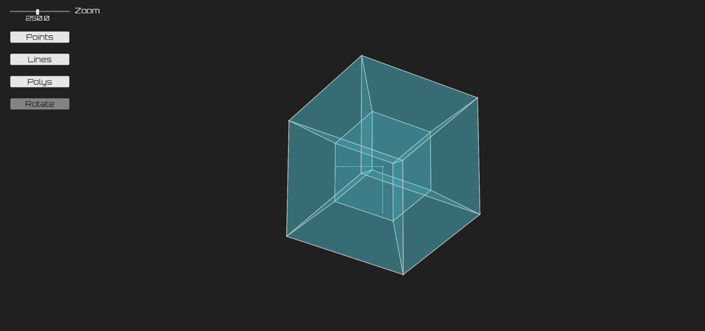

# js-3D_proyection
This is a proyect about projecting 3D objects to 2D I built using <a href="https://p5js.org/">p5.js</a>.
## URL
This project is hosted by github pages at <a href="https://pabloqb2000.github.io/js-3D_proyection/">this link</a>.
## Options
Inside the page you can change:
- The zoom used by the camera
- The camera mode between orthographic and perspective
- Whether to crop the points behind the camera
- Whether to show the points/lines/polygons
- The 3D object to be proyected
- The camera position and rotation
## Controls
The contros are minecraft like, you can use WASD to move towards the direction of view, SPACE of SHIFT to move up and down and you can rotate the camera by clickng the rotate button and moving your mouse arround, finally you can rotate the camera on the z axis with the left and right arrows.
## Screenshot
</img>
## References
To find more information about the <b>awesome</b> library used for this project visit:
<a href="https://p5js.org/"> https://p5js.org/ </a>
## Other projects
Checkout my other projects at <a href="https://pabloqb2000.github.io/Click_math/">Click math</a>
